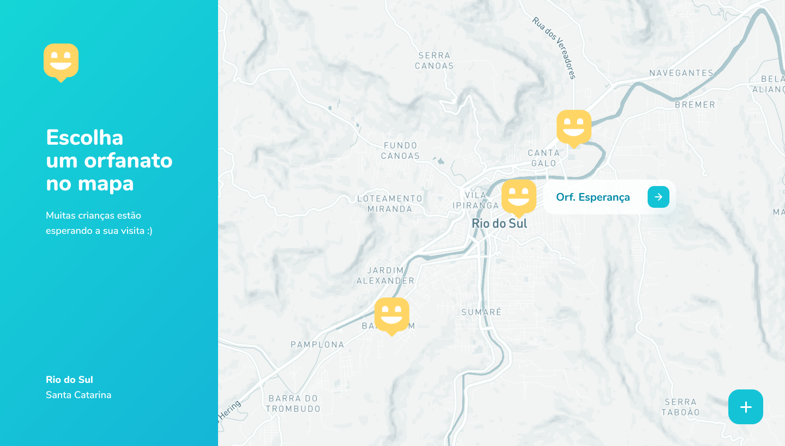
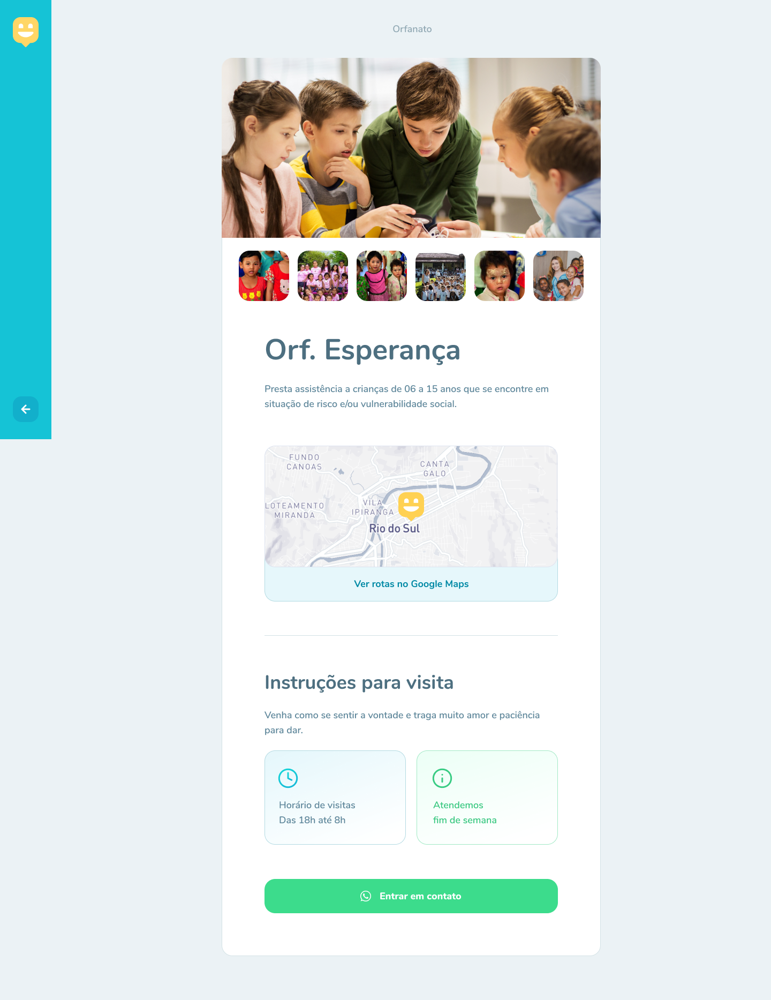

<p align="center">
  

  

  <a href="https://www.twitter.com/motherfocs/">
    
  </a>
  
  <a href="https://github.com/paulop2/Happy-NLW3/commits/master">
    
  </a>
    
   
   <a href="https://github.com/paulop2/Happy-NLW3/stargazers">
    
  </a>

  <a href="https://blog.rocketseat.com.br/como-fazer-um-bom-readme/">
    
  </a>
  

  
 
</p>
<h1 align="center">
    
    <p align="center">
    <strong>happy</strong>
    </p>
</h1>

<p align="center">
  
</p>


<h4 align="center"> 
	🚀 Next Level Week 3 - Concluído 🚀 
</h4>

<p align="center">
 <a href="#-sobre-o-projeto">Sobre</a> •
 <a href="#-funcionalidades">Funcionalidades</a> •
 <a href="#-layout">Layout</a> • 
 <a href="#-como-executar-o-projeto">Como executar</a> • 
 <a href="#-tecnologias">Tecnologias</a> • 
 <a href="#-autor">Autor</a> • 
 <a href="#user-content--licença">Licença</a>
</p>


## 💻 Sobre o projeto

 Happy - é uma forma de conectar entidades de acolhimento às pessoas que querem visitar e trazer felicidade para essas entidades .


Projeto desenvolvido durante a **NLW 3 - Next Level Week 3ª edição** oferecida pela [Rocketseat](https://nextlevelweek.com/).
O NLW é uma experiência online com muito conteúdo prático, desafios e hacks onde o conteúdo fica disponível durante uma semana, com o objetivo de criar uma aplicação do começo ao fim para alcançar o próximo nível.

---

## ⚙️ Funcionalidades

- [x] Entidades podem se cadastrar na plataforma web enviando:
  - [x] imagens;
  - [x] nome da entidade, descrição, instruções e whatsapp;
  - [x] endereço para que ele possa aparecer no mapa;
  - [x] horário para visitas;
  - [x] disponibilidade nos finais de semana;


- [x] Os usuários tem acesso ao aplicativo móvel, onde podem:
  - [x] cadastrar uma nova entidade;
  - [x] navegar pelo mapa para ver as instituições cadastradas;
  - [x] entrar em contato com a entidade através do WhatsApp e visualizar as informações cadastradas;

---

## 🎨 Layout

O layout da aplicação está disponível no Figma:

<a href="https://www.figma.com/file/zwMPdDRrRPDEPKs7qWNWvd/Happy-Web-Copy">
  
</a>

<a href="https://www.figma.com/file/MAU8bXIU5wKd3NARVLLieG/Happy-Mobile-Copy">
  
</a>


### Web

<p align="center" style="justify-content: center;">
  


</p>

<p align="center" style="justify-content: center;">
  
</p>

---

## 🚀 Como executar o projeto

Este projeto é divido em três partes:
1. Backend (pasta backend) 
2. Frontend (pasta web)
3. Mobile (pasta mobile)

💡Tanto o Frontend quanto o Mobile precisam que o Backend esteja sendo executado para funcionar.

### Pré-requisitos

Antes de começar, você vai precisar ter instalado em sua máquina as seguintes ferramentas:
- [Git](https://git-scm.com), 
- [Node.js](https://nodejs.org/en/),
- [Yarn](https://classic.yarnpkg.com/),
- [Expo](https://expo.io/).

Além disto é bom ter um editor para trabalhar com o código como [VSCode](https://code.visualstudio.com/)

#### 🎲 Rodando o Backend (servidor)

```bash

# Clone este repositório
$ git clone git@github.com:paulop2/Happy-NLW3.git

# Acesse a pasta do projeto no terminal/cmd
$ cd Happy-NLW3

# Vá para a pasta server
$ cd backend

# Instale as dependências
$ yarn install

# Use esse script para rodar as dependências
$ yarn typeorm migration:run

# Execute a aplicação em modo de desenvolvimento
$ yarn dev

# O servidor inciará na porta:3333 - acesse http://localhost:3333 

```


#### 🧭 Rodando a aplicação web (Frontend)

```bash

# Clone este repositório
$ git clone git@github.com:paulop2/Happy-NLW3.git

# Acesse a pasta do projeto no seu terminal/cmd
$ cd Happy-NLW3

# Vá para a pasta da aplicação Front End
$ cd web

# Instale as dependências
$ yarn install

# Execute a aplicação em modo de desenvolvimento
$ yarn start

# A aplicação será aberta na porta:3000 - acesse http://localhost:3000

```

#### 🧭 Rodando a aplicação no expo (Mobile)

```bash

# Clone este repositório
$ git clone git@github.com:paulop2/Happy-NLW3.git

# Acesse a pasta do projeto no seu terminal/cmd
$ cd Happy-NLW3

# Vá para a pasta da aplicação Front End
$ cd mobile

# Instale as dependências
$ yarn install

# Execute a aplicação em modo de desenvolvimento
$ expo start

# A aplicação será inicializada e apresentará um QR code.

```

---

## 🛠 Tecnologias

As seguintes ferramentas foram usadas na construção do projeto:

#### **Website**  ([React](https://reactjs.org/)  +  [TypeScript](https://www.typescriptlang.org/))

-   **[React Router Dom](https://github.com/ReactTraining/react-router/tree/master/packages/react-router-dom)**
-   **[React Icons](https://react-icons.github.io/react-icons/)**
-   **[Axios](https://github.com/axios/axios)**
-   **[Leaflet](https://react-leaflet.js.org/en/)**
-   **[React Leaflet](https://react-leaflet.js.org/)**

> Veja o arquivo  [package.json](https://github.com/paulop2/Happy-NLW3/blob/master/web/package.json)

#### **Backend**  ([NodeJS](https://nodejs.org/en/)  +  [TypeScript](https://www.typescriptlang.org/))

-   **[Express](https://expressjs.com/)**
-   **[CORS](https://expressjs.com/en/resources/middleware/cors.html)**
-   **[TypeORM](https://typeorm.io)**
-   **[SQLite](https://github.com/mapbox/node-sqlite3)**
-   **[dotENV](https://github.com/motdotla/dotenv)**
-   **[Multer](https://github.com/expressjs/multer)**
-   **[Joi](https://github.com/hapijs/joi)**

> Veja o arquivo  [package.json](https://github.com/paulop2/Happy-NLW3/blob/master/backend/package.json)

#### **Mobile**  ([React Native](http://www.reactnative.com/)  +  [TypeScript](https://www.typescriptlang.org/))

-   **[Expo](https://expo.io/)**
-   **[Expo Google Fonts](https://github.com/expo/google-fonts)**
-   **[React Navigation](https://reactnavigation.org/)**
-   **[React Native Maps](https://github.com/react-native-community/react-native-maps)**
-   **[Expo Constants](https://docs.expo.io/versions/latest/sdk/constants/)**
-   **[Axios](https://github.com/axios/axios)**
-   **[Expo Location](https://docs.expo.io/versions/latest/sdk/location/)**

> Veja o arquivo  [package.json](https://github.com/paulop2/Happy-NLW3/blob/master/mobile/package.json)

#### **Utilitários**

-   Protótipo:  **[Figma](https://www.figma.com/)**  →  **[Protótipo (happy)](https://www.figma.com/file/zwMPdDRrRPDEPKs7qWNWvd/Happy-Web-Copy)**
-   SQL Editor: **[Beekeeper Studio](https://github.com/beekeeper-studio/beekeeper-studio/releases)**
-   Maps:  **[Leaflet](https://react-leaflet.js.org/en/)**
-   Editor:  **[Visual Studio Code](https://code.visualstudio.com/)**  → Extensions:  
-   Teste de API:  **[Insomnia](https://insomnia.rest/)**
-   Ícones:  **[Feather Icons](https://feathericons.com/)**,  **[Font Awesome](https://fontawesome.com/)**
-   Fontes:  **[Nunito](https://fonts.google.com/specimen/Nunito)**


---
## 💪 Como contribuir para o projeto

1. Faça um **fork** do projeto.
2. Crie uma nova branch com as suas alterações: `git checkout -b my-feature`
3. Salve as alterações e crie uma mensagem de commit contando o que você fez: `git commit -m "feature: My new feature"`
4. Envie as suas alterações: `git push origin my-feature`
> Caso tenha alguma dúvida confira este [guia de como contribuir no GitHub](./CONTRIBUTING.md)

---

##  Autor


 <sub><b>Paulo Vitor de Souza</b></sub></a> <a href="https://blog.rocketseat.com.br/author/thiago/" title="Rocketseat"></a>
 <br />

[](https://twitter.com/motherfocs) [](https://www.linkedin.com/in/paulop2-vs/) 
[](mailto:paulo225vitor@gmail.com)

<!-- Corrigir o link para o linkedin -->

---

## 📝 Licença

Este projeto esta sobe a licença [MIT](./LICENSE).

---

##  Versões do README

[🚧Português 🇧🇷🚧](./README.md)  |  [🚧(Em construção) Inglês sem emojis 🇺🇸🚧](./) | [🚧(Em construção) Portugues sem logo  🇧🇷🚧](./) 